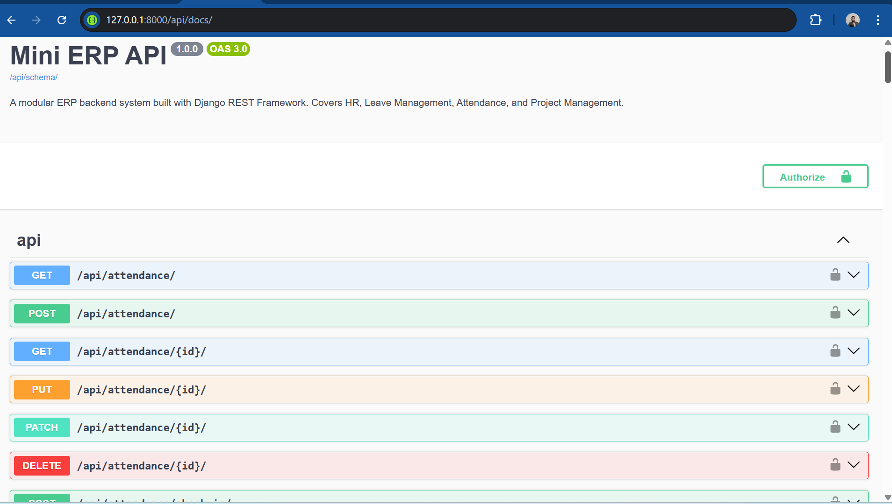

# Mini ERP Backend System

## 1. Project Title and Description
Mini ERP Backend System is a modular Django REST Framework API for:
- Account authentication (register, login, logout, profile)
- HR management (departments, positions, employees)
- Leave management (request, approve, reject, cancel)
- Attendance management (check-in, check-out, records, summary)
- Project management (projects, members, tasks, task completion)

It also provides OpenAPI schema generation and interactive API docs through Swagger UI.

## 2. Technologies Used
- Python 3
- Django 4.2
- Django REST Framework 3.15
- drf-spectacular 0.27 (OpenAPI + Swagger)
- django-filter 23
- MySQL / SQLite (development)
- python-decouple

## 3. Setup Instructions
1. Clone the repository and move into the project folder:
git clone https://github.com/MuseMulatu/erp-backend.git
cd erp-backend

2. Create and activate a virtual environment:
python -m venv erp_env
# Windows
erp_env\Scripts\activate
# macOS/Linux
source erp_env/bin/activate

3. Install dependencies:
pip install -r requirements.txt

4. Apply database migrations:
python manage.py makemigrations
python manage.py migrate

5. (Optional) Create an admin user:
python manage.py createsuperuser

## 4. Running the Server
python manage.py runserver

Default local URL: http://127.0.0.1:8000/

## 5. API Endpoint List
Base URL: http://127.0.0.1:8000/api/

| Module | Method | Endpoint | Description | Auth |
|---|---|---|---|---|
| Accounts | POST | /api/auth/register/ | Register new user and return token | No |
| Accounts | POST | /api/auth/login/ | Login and return token | No |
| Accounts | POST | /api/auth/logout/ | Logout (delete token) | Yes |
| Accounts | GET | /api/auth/me/ | Current user profile | Yes |
| HR | GET, POST | /api/departments/ | List/Create departments | Yes |
| HR | GET, PUT, PATCH, DELETE | /api/departments/{id}/ | Retrieve/Update/Delete department | Yes |
| HR | GET, POST | /api/employees/ | List/Create employees | Yes |
| HR | GET, PATCH, DELETE | /api/employees/{id}/ | Retrieve/Update/Delete employee | Yes |
| HR | GET | /api/employees/{id}/profile/ | Employee full profile | Yes |
| HR | GET | /api/employees/{id}/direct_reports/ | Employee direct reports | Yes |
| HR | POST | /api/employees/{id}/deactivate/ | Terminate/Deactivate employee | Yes |
| Leave | GET | /api/leave-types/ | List all leave types | Yes |
| Leave | GET, POST | /api/leaves/ | List my leaves / Submit leave request | Yes |
| Leave | GET, PATCH | /api/leaves/{id}/ | Retrieve/Update leave request | Yes |
| Leave | POST | /api/leaves/{id}/approve/ | Approve leave request | Yes |
| Leave | POST | /api/leaves/{id}/reject/ | Reject leave request | Yes |
| Leave | POST | /api/leaves/{id}/cancel/ | Cancel leave request | Yes |
| Attendance | POST | /api/attendance/check-in/ | Record check-in | Yes |
| Attendance | POST | /api/attendance/check-out/ | Record check-out | Yes |
| Attendance | GET | /api/attendance/ | List attendance records | Yes |
| Attendance | GET | /api/attendance/summary/ | Monthly summary stats | Yes |
| Projects | GET, POST | /api/projects/ | List/Create projects | Yes |
| Projects | GET, PATCH | /api/projects/{id}/ | Retrieve/Update project | Yes |
| Projects | GET | /api/projects/{id}/members/ | Team members | Yes |
| Projects | GET, POST | /api/tasks/ | List/Create tasks | Yes |
| Projects | PATCH | /api/tasks/{id}/ | Update task | Yes |
| Projects | POST | /api/tasks/{id}/complete/ | Mark task done | Yes |
| Docs | GET | /api/schema/ | OpenAPI schema | No |
| Docs | GET | /api/docs/ | Swagger UI | No |
| Docs | GET | /api/redoc/ | ReDoc UI | No |

## 6. Running Tests
Run the API test suite:
python manage.py test tests --verbosity=2

Generate coverage report:
coverage run manage.py test tests
coverage report -m

## 7. Swagger Screenshot 
Swagger UI: http://127.0.0.1:8000/api/docs/

## 8. Environment Variables
Create a .env file in the project root.

| Key | Example | Purpose |
|---|---|---|
| SECRET_KEY | your_secure_django_secret_key | Django secret key |
| DEBUG | True | Development debug mode |
| ALLOWED_HOSTS | 127.0.0.1,localhost | Allowed hostnames |

## 9. Author
- Muse Mulatu
- GitHub: MuseMulatu.g@gmail.com